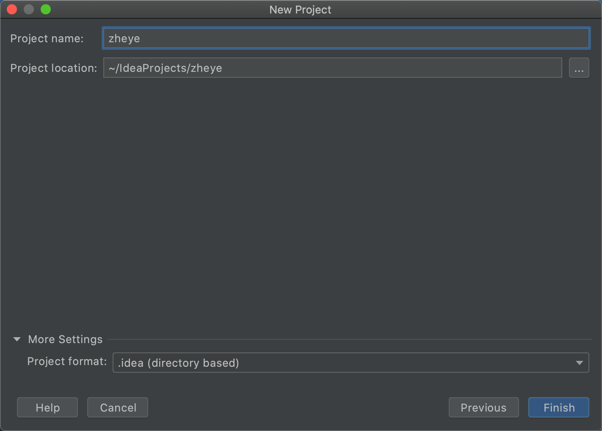
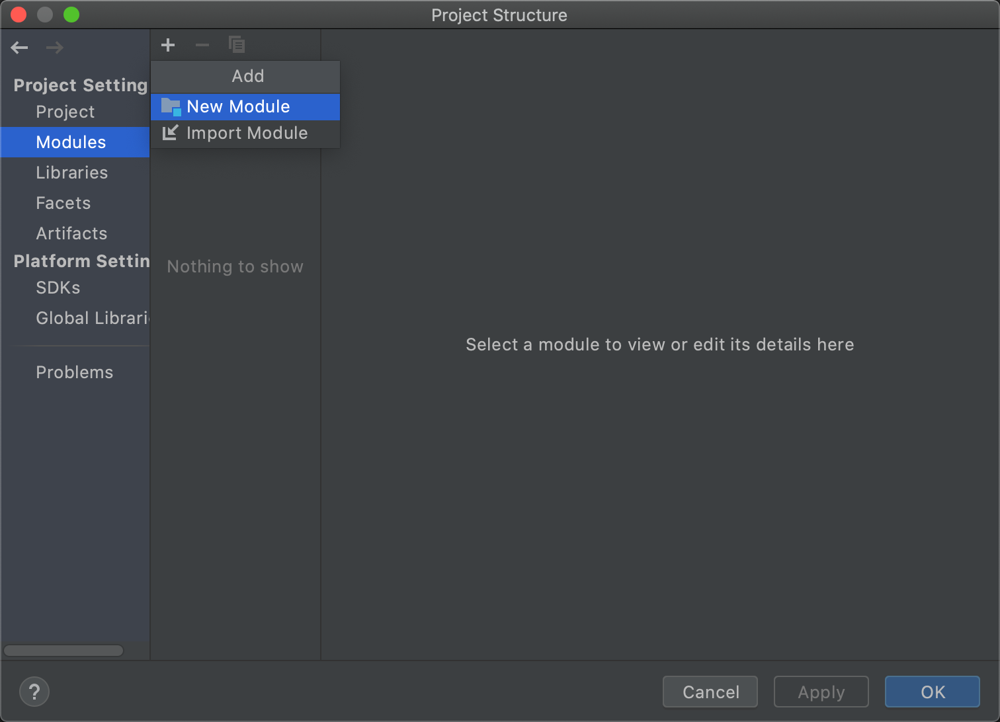
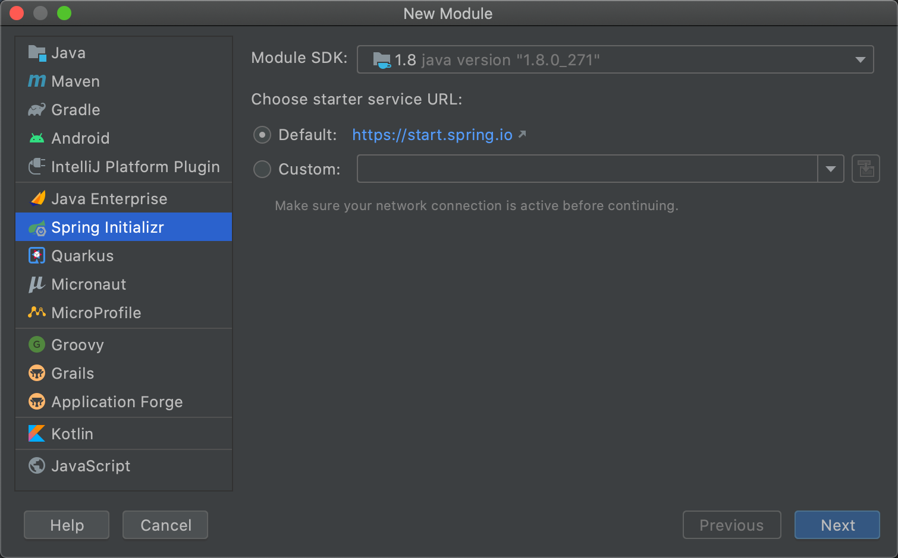
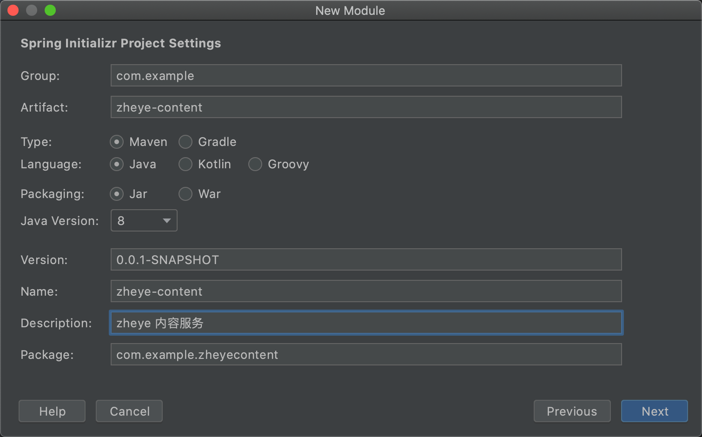
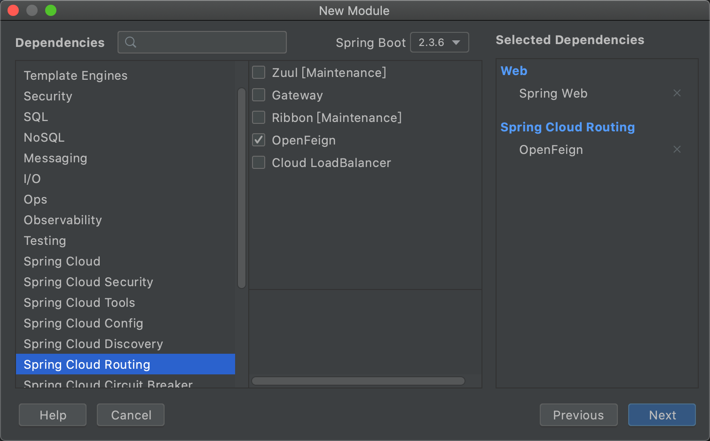
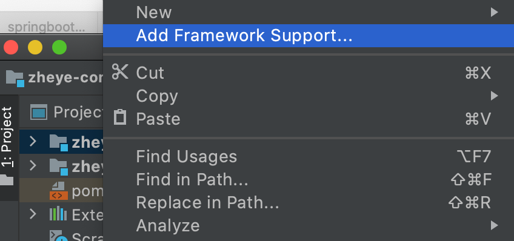
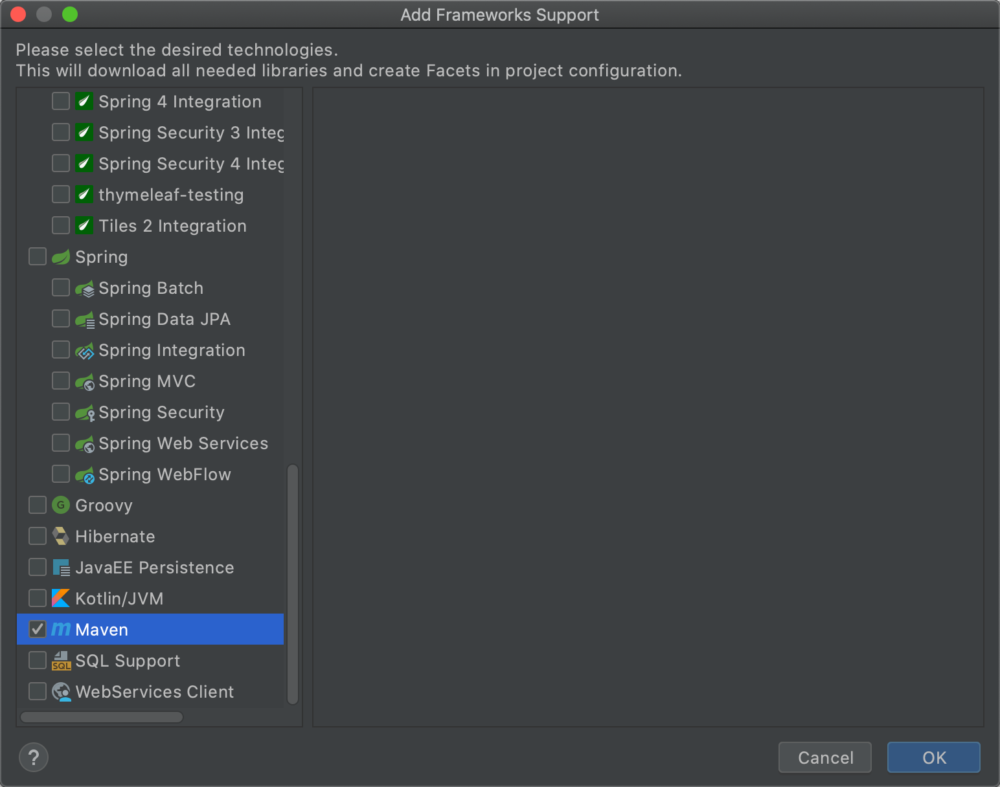

[SpringCloud项目搭建]([http://www.jayh.club/#/02.PassJava%E6%9E%B6%E6%9E%84%E7%AF%87/03.%E6%90%AD%E5%BB%BA%E7%AE%A1%E7%90%86%E5%90%8E%E5%8F%B0?id=_5%e5%90%af%e5%8a%a8renren-fast%e6%9c%8d%e5%8a%a1](http://www.jayh.club/#/02.PassJava架构篇/03.搭建管理后台?id=_5启动renren-fast服务))

####  1.新建空项目

mage-20201127103055573.png)



#### 2. 添加module







##### - 添加依赖组件




##### 需要添加的模块

1. 内容管理
2. 用户管理


#### 3. 为根目录添加pom.xml文件

添加下面的内容

```xml
<?xml version="1.0" encoding="UTF-8"?>
<project xmlns="http://maven.apache.org/POM/4.0.0" xmlns:xsi="http://www.w3.org/2001/XMLSchema-instance"
         xsi:schemaLocation="http://maven.apache.org/POM/4.0.0 https://maven.apache.org/xsd/maven-4.0.0.xsd">
    <modelVersion>4.0.0</modelVersion>
    <groupId>com.example.zheye</groupId>
    <artifactId>zheye</artifactId>
    <version>0.0.1-SNAPSHOT</version>
    <name>zheye</name>
    <description>者也-信息服务</description>
    <packaging>pom</packaging>

    <modules>
        <module>zheye-content</module>
        <module>zheye-user</module>
    </modules>
</project>
```

#### 4. 为项目添加maven

https://blog.csdn.net/tjj3027/article/details/105271549/

##### 1. 鼠标右键点击项目



##### 2.勾选maven




## renren-fast

### 1. ‘parent.relativePath’ of POM io.renren:renren-fast:3.0.0 xxxx

https://blog.csdn.net/weixin_43766278/article/details/107734161


项目部署到自己的项目的根目录下，maven等一直报错？

先将将renren-fast单独建立一个项目，跑通之后在放到自己的项目下面。

## Mysql

下载

https://dev.mysql.com/downloads/mysql/

查看mysql安装位置

```bash
ps -ef|grep mysql 
```

登录mysql命令行

```bash
cd /usr/local/mysql/bin
./mysql -u root -p

ALTER USER 'root'@'localhost' IDENTIFIED BY '新密码';
```


## Mac 安装Homebrew

https://segmentfault.com/a/1190000022347755

```bash

/bin/bash -c "$(curl -fsSl https://raw.githubusercontent.com/Homebrew/install/master/install.sh)"
```

安装 npm

```bash
brew install node
node自带npm包管理器
```

## 打开vscode进入vue目录中

使用命令运行项目

1. 安装依赖 npm install

   因为速度慢，使用cnpm

   ```shell
   npm install -g cnpm --registry=https://registry.npm.taobao.org
   
   cnpm install
   安装过程很长，耐心等待。
   
   ```

2.  运行项目 npm run dev

## Oracle 错误

1. 查询结果为零

https://blog.csdn.net/qq_40194399/article/details/84168598


## Thymeleaf使用

https://www.jianshu.com/p/3426794a17cb


Java 项目

https://github.com/Jackson0714/PassJava-Platform

影像匀色处理

https://blog.csdn.net/cmfootball/article/details/83685343


Oracle + Spring

https://www.jianshu.com/p/f0cbed671897

Spring 实例讲解

https://blog.csdn.net/chaiqunxing51/article/month/2018/05