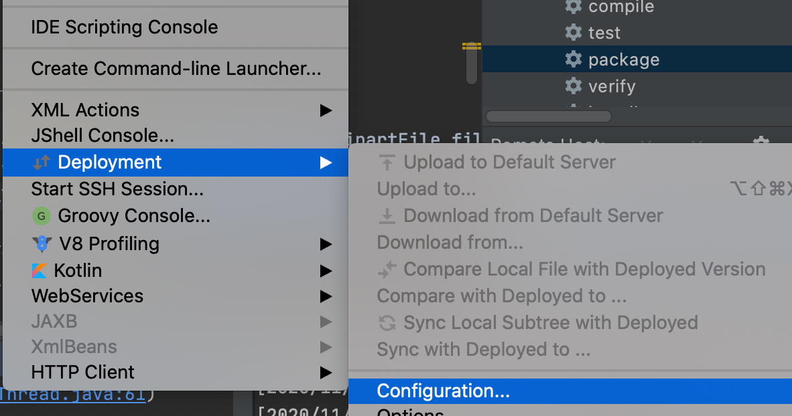
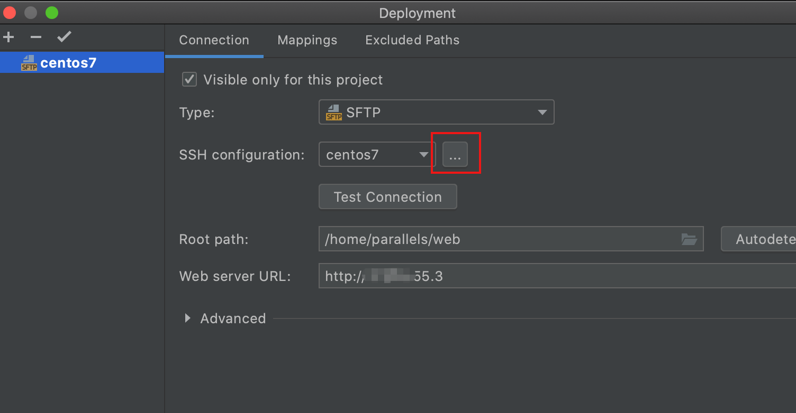
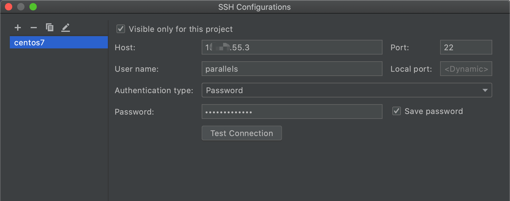
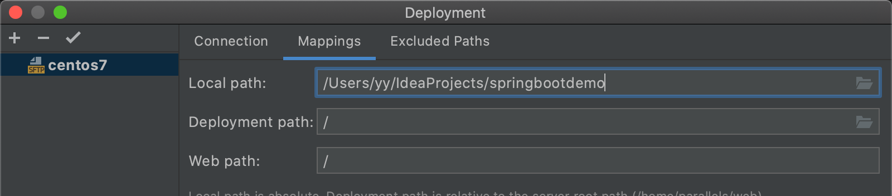
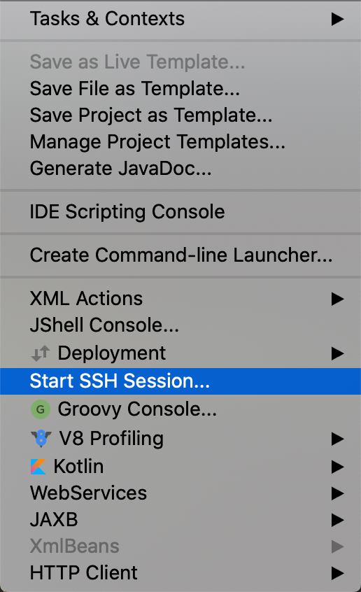

## 数据库

### mysql

https://www.cnblogs.com/jinbuqi/p/11008758.html


## 文件上传

1. [上传文件大小限制](https://blog.csdn.net/shi0299/article/details/69525848?utm_medium=distribute.pc_relevant.none-task-blog-BlogCommendFromBaidu-1.control&depth_1-utm_source=distribute.pc_relevant.none-task-blog-BlogCommendFromBaidu-1.control)
2. [上传代码](https://blog.csdn.net/qq_37936542/article/details/103879341)
3. [BufferedOutputStream](https://www.cnblogs.com/star521/p/8931567.html)
4. [文件上传路径配置](https://blog.csdn.net/justry_deng/article/details/81406752)
5. [带进度条的文件上传](https://www.cnblogs.com/liubin0509/p/9778343.html)
6. https://www.cnblogs.com/jclian91/p/9277216.html
7. [Springboot配置映射路径](https://blog.csdn.net/baidu_28068985/article/details/103840426)
8. [Springboot获取服务器ip地址](https://blog.csdn.net/djzhao627/article/details/105674827)
9. 

## 注解

1. [ResponseBody](https://www.cnblogs.com/qiankun-site/p/5774325.html)

   加了这个注解，返回到前端为字符串数据，否则为html页面数据。

2. [读取配置文件](https://blog.csdn.net/flygoa/article/details/58075398?utm_medium=distribute.pc_relevant.none-task-blog-BlogCommendFromBaidu-2.control&depth_1-utm_source=distribute.pc_relevant.none-task-blog-BlogCommendFromBaidu-2.control)

3. [Autowired](https://www.cnblogs.com/xrq730/p/5313412.html)


## mac 虚拟机下载

https://qiujunya.com/article/2020/2/8/69.html

安装centos


## 问题


### 1. getOutputStream() has already been called for this response

springboot

return 字符串时，controller上要加一个responsebody注解


## 项目打包

https://www.cnblogs.com/zuidongfeng/p/8859229.html


Failed to execute goal org.apache.maven.plugins:maven-surefire-plugin:2.22.2:test (default-test) on project springbootdemo: There are test failures.

https://blog.csdn.net/caiwenfeng_for_23/article/details/44514947


## 项目部署

在intellij中连接服务器




配置服务器ip地址

https://zhuanlan.zhihu.com/p/29567536

https://blog.csdn.net/hehuihh/article/details/80829818








开启连接



#### 关闭防火墙

https://blog.csdn.net/qq_45077173/article/details/106925557

####  添加对外开放端口

无法外网访问服务器上的网页，可能是8080端口没有对外开放。

https://blog.csdn.net/tongdengquan/article/details/82980017


#### 运行jar

```bash
java -jar springboot-helloworld-0.0.1-SNAPSHOT.jar
```


## Centos

### 命令

#### 查看文件夹路径

```shell
pwd
```

#### 查看网络地址

```bash
ifconfig
```


## 文章

1. [美团](https://tech.meituan.com/archives)
2. 


## html前端编辑器

1. https://vular.cn/rxeditor/
2. https://www.runoob.com/try/bootstrap/layoutit/#